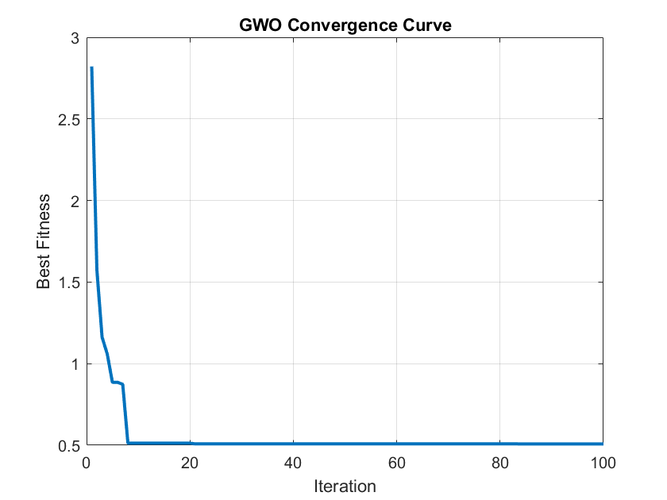
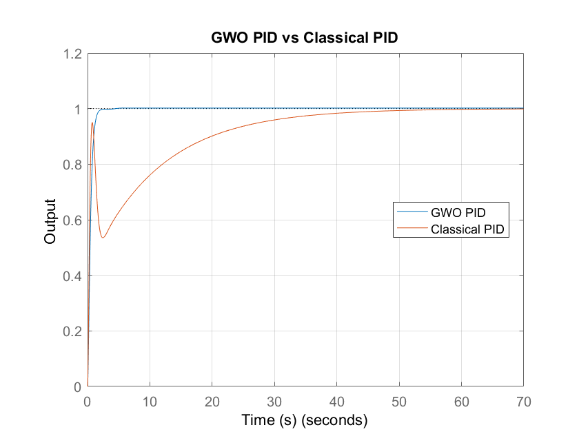

# GWO-Based PID Tuning for DC Motor Speed Control

## Overview

This project presents the design and optimization of a PID controller for DC motor speed control using the **Grey Wolf Optimizer (GWO)**.

The objective is to determine suitable PID gains:

$$
K_p,\quad K_i,\quad K_d
$$

by formulating PID tuning as an optimization problem.

A classical PID controller is also designed using MATLAB's `pidtune` function and used as a baseline for comparison.

The project is implemented using **MATLAB**.

---

## Objectives

The main objectives of this project are:

* Model a DC motor for speed control.
* Implement a PID controller.
* Optimize the PID parameters using the Grey Wolf Optimizer.
* Minimize the tracking error using an Integral of Absolute Error (IAE) fitness function.
* Design a classical PID controller using MATLAB.
* Compare the GWO-optimized PID with the classical PID.
* Evaluate the controllers using rise time, settling time, overshoot and peak response.

---

## Control Structure

The control system can be represented as:

```text
Reference
    │
    ▼
 PID Controller
    │
    ▼
 DC Motor
    │
    ▼
 Motor Speed
    │
    └─────────────── Feedback
```

The tracking error is defined as:

$$
e(t)=r(t)-y(t)
$$

where:

* (r(t)) is the reference speed.
* (y(t)) is the actual motor speed.
* (e(t)) is the tracking error.

---

# DC Motor Model

The DC motor is represented by its mathematical transfer function.

The general transfer function used for speed control is:

$$
G(s)=
\frac{K}
{(Ls+R)(Js+b)+K^2}
$$

where:

* (R) — armature resistance
* (L) — armature inductance
* (J) — rotor inertia
* (b) — viscous friction coefficient
* (K) — motor constant


---

# PID Controller

The PID controller is defined as:

$$
C(s)=Kp+(1\Ki)s+Kds
$$

where:

* (K_p) — proportional gain
* (K_i) — integral gain
* (K_d) — derivative gain

The optimization vector is therefore:

$$
\mathbf{x}=[Kp,Ki,Kd]
$$

---

# Grey Wolf Optimizer

The **Grey Wolf Optimizer (GWO)** is a population-based metaheuristic optimization algorithm inspired by the social hierarchy and hunting behavior of grey wolves.

In this project, each wolf represents a candidate PID controller:

$$
[Kp,Ki,Kd]
$$

For each candidate solution:

1. The PID controller is created.
2. The DC motor response is simulated.
3. The tracking error is calculated.
4. The fitness value is evaluated.
5. The best candidate solutions are identified.
6. The wolf positions are updated.
7. The process continues until the maximum number of iterations is reached.

The optimization hierarchy consists of:

* Alpha
* Beta
* Delta
* Remaining wolves

The Alpha solution represents the best PID parameters found during the optimization.

---

# Fitness Function

The PID parameters are optimized using the **Integral of Absolute Error (IAE)**.

The objective function is:

$$
\boxed{
J=\int_0^T |e(t)|\,dt
}
$$

where:

$$
e(t)=r(t)-y(t)
$$

In MATLAB, the numerical integration is implemented using:

```matlab
J = trapz(t, abs(e));
```

The optimization problem is therefore:

$$
\boxed{
\min_{K_p,K_i,K_d} J
}
$$

A lower objective value indicates a lower accumulated absolute tracking error.

---

# GWO Configuration

The final optimization run used:

| Parameter              |               Value |
| ---------------------- | ------------------: |
| Algorithm              | Grey Wolf Optimizer |
| Number of agents       |                  30 |
| Number of iterations   |                 100 |
| Optimization variables |     \(K_p,K_i,K_d\) |
| Fitness function       |                 IAE |
| Best objective value   |            0.508005 |

The optimization showed a rapid decrease in the objective value during the first iterations, followed by a convergence phase.

The best objective value obtained was:

$$
\boxed{J=0.508005}
$$

---

# GWO Convergence

The best objective value evolved during the optimization as follows:

```text
Iteration 1   → 2.821356
Iteration 2   → 1.573726
Iteration 3   → 1.162634
Iteration 4   → 1.059551
Iteration 5   → 0.885679
Iteration 8   → 0.512582
Iteration 21  → 0.508291
Iteration 56  → 0.508287
Iteration 84  → 0.508085
Iteration 99  → 0.508005
Iteration 100 → 0.508005
```

The convergence behavior shows that most of the improvement occurred during the early iterations, while later iterations produced only small improvements.



---

# Optimized GWO PID Parameters

The best PID parameters obtained in the final optimization run were:

$$
\boxed{Kp=0.047132}
$$

$$
\boxed{Ki=20.057708}
$$

$$
\boxed{Kd=10.000000}
$$

with:

$$
\boxed{J=0.508005}
$$

The corresponding MATLAB values are:

```matlab
Kp = 0.047132;
Ki = 20.057708;
Kd = 10.000000;
```


---

# Classical PID Controller

For comparison, a classical PID controller was designed using MATLAB's `pidtune` function:

```matlab
C_classical = pidtune(G,'PID');
```

The resulting parameters were:

$$
K{p,c}=9.769135
$$

$$
K{i,c}=1.635825
$$

$$
K{d,c}=14.585304
$$

The classical PID therefore uses:

```matlab
Kpc = 9.769135;
Kic = 1.635825;
Kdc = 14.585304;
```

These parameters provide a baseline for evaluating the GWO-optimized controller.

---

# Performance Comparison

Both controllers were evaluated using the same DC motor model and reference signal.

| Performance Metric |      GWO-PID | Classical PID |
| ------------------ | -----------: | ------------: |
| Rise Time          | **0.8781 s** |      0.4860 s |
| Settling Time      | **1.5592 s** |     37.9766 s |
| Overshoot          |     0.2148 % |       **0 %** |
| Undershoot         |          0 % |           0 % |
| Peak               |       1.0021 |        0.9995 |
| Peak Time          |     5.6237 s |     78.8687 s |



---

# Discussion

The comparison shows different transient characteristics between the two controllers.

### Rise Time

The classical PID has a shorter rise time:

$$
0.486s
$$

compared with:

$$
0.8781s
$$

for the GWO-PID.

Therefore, the classical controller initially reaches the reference faster.

### Settling Time

The GWO-PID has a significantly shorter settling time:

$$
\boxed{1.5592\;s}
$$

while the classical PID requires approximately:

$$
37.9766\;s
$$

to settle.

This represents a substantial reduction in settling time for the tested configuration.

### Overshoot

The GWO-PID produces a very small overshoot:

$$
0.2148\%
$$

while the classical PID has:

$$
0\%
$$

overshoot.

Therefore, the GWO-PID introduces a very small transient overshoot while achieving a much shorter settling time.

### Overall response

For the tested configuration, the GWO-PID provides a faster settling behavior with very small overshoot, whereas the classical PID reaches the reference slightly faster initially but exhibits a much longer settling process.

The result demonstrates the influence of optimization on the transient behavior of the DC motor controller.

---

# Important Observation About the Fitness Function

The current fitness function is:

$$
J=\int_0^T|e(t)|dt
$$

which focuses on the accumulated tracking error.

It does **not explicitly include overshoot or settling time**.

The GWO algorithm therefore searches for PID parameters that minimize IAE rather than directly minimizing every time-domain performance metric.

A future version of the project can investigate a weighted objective function such as:

$$
J=w_1IAE+w_2M_p+w_3T_s
$$

where:

* \(IAE\) — Integral of Absolute Error
* \(M_p\) — percentage overshoot
* \(T_s\) — settling time
* \(w_1,w_2,w_3\) — weighting coefficients

This could provide more direct control over the trade-off between tracking accuracy, settling time and overshoot.

---

# Project Structure

```text
GWO-PID-DC-Motor/
│
├── README.md
│
├── src/
│   ├── main.m
│   ├── GWO.m
│   ├── classical.m
│   └── DC_motor_model.m
|   └── Pid_obj.m
│
├── results/
│   ├── convergence_curve.png
│   ├── PID_response_comparison.png
│   └── performance_comparison.png
│

```

---

# Requirements

* MATLAB
* Control System Toolbox
* A MATLAB version compatible with the provided scripts

---

# How to Run

1. Clone or download this repository.
2. Open MATLAB.
3. Set the repository folder as the MATLAB working directory.
4. Add the `src` folder to the MATLAB path.
5. Open `main.m`.
6. Run:

```matlab
main
```

7. The GWO optimization will start.
8. The optimized PID parameters will be displayed.
9. The convergence curve can be analyzed.
10. The GWO-PID response can be compared with the classical PID response.

---

# Future Work

Possible extensions of this project include:

* Performing multiple independent GWO runs.
* Studying the influence of the number of agents.
* Studying the influence of the number of iterations.
* Improving the fitness function.
* Including overshoot and settling time in the objective function.
* Testing other metaheuristic optimization algorithms such as PSO and GA.
* Testing the controller under disturbances.
* Performing robustness analysis with variations in motor parameters.
* Implementing the controller experimentally on a real DC motor.

---


Control Systems | Optimization | MATLAB

---

# License

This project is provided for educational and research purposes.
